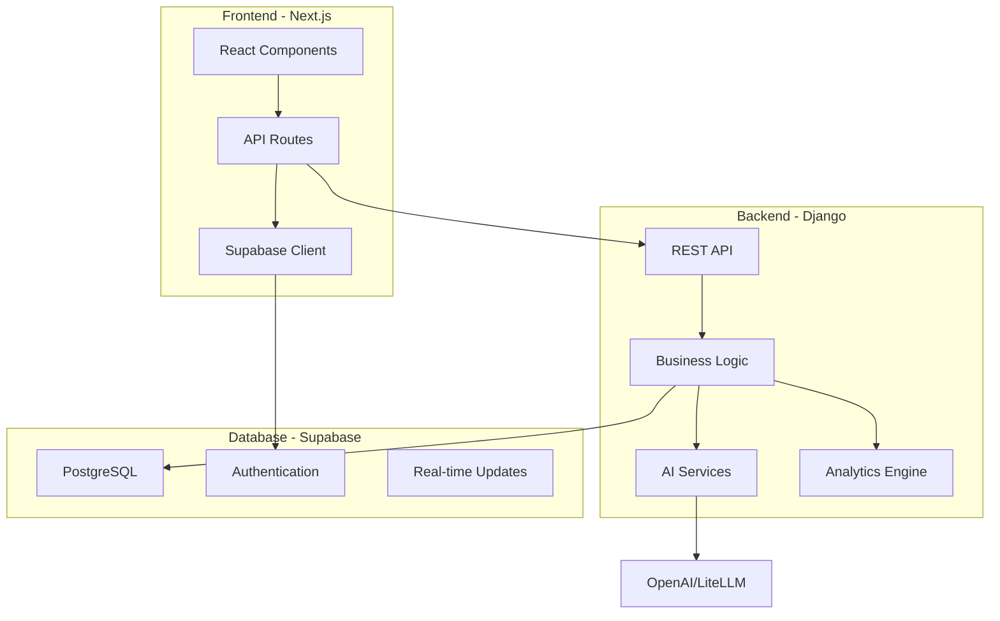

<div align="center">
  <br />
  <h1 align="center">
    
  </h1>
  
  <h3 align="center">🚀 Enterprise Skill Assessment & HR Analytics Platform</h3>
  
  <p align="center">
    <strong>Transform workforce capabilities with AI-powered skill assessments and real-time analytics</strong>
  </p>
  
  <p align="center">
    
    
    
    
  </p>
</div>

<br />

---

## 📋 Table of Contents

- [Overview](#-overview)
- [Architecture](#-architecture)
- [Tech Stack](#-tech-stack)
- [Prerequisites](#-prerequisites)
- [Environment Setup](#-environment-setup)
- [Installation Guide](#-installation-guide)
- [Authentication & Security](#-authentication--security)
- [API Documentation](#-api-documentation)
- [Creating New Components](#-creating-new-components)
- [Design System](#-design-system)
- [Database Schema](#-database-schema)
- [Deployment](#-deployment)
- [Troubleshooting](#-troubleshooting)

---

## 🌟 Overview

Adivirtus AI is a comprehensive skill assessment and HR analytics platform that helps organizations:

- **Assess Skills**: Evaluate technical, soft skills, domain knowledge, and SOP compliance
- **Identify Gaps**: Automatically detect skill gaps and prioritize training needs
- **Analytics Dashboard**: Real-time insights into workforce capabilities
- **Generate Reports**: Executive summaries, compliance reports, and training ROI analysis
- **Track Progress**: Monitor skill development and training effectiveness

### Key Features

- 🎯 **AI-Powered Assessments** - Intelligent skill evaluation using OpenAI, CrewAI, and LiteLLM
- 📊 **Real-time Analytics** - Live dashboard updates and performance metrics
- 🔍 **Gap Analysis** - Automated identification of skill deficiencies
- 📈 **Visual Reports** - Interactive charts, heatmaps, and skill trees
- 🔐 **Enterprise Security** - Role-based access control and secure authentication
- 📱 **Responsive Design** - Works seamlessly across all devices

---

## 🏗 Architecture



---

## 🛠 Tech Stack

### Frontend
- **Framework**: Next.js 15 (App Router)
- **Language**: TypeScript 5.0
- **Styling**: Tailwind CSS 4.0
- **State Management**: React Query (TanStack Query)
- **UI Components**: Custom Design System + Radix UI
- **Animations**: Framer Motion
- **Charts**: Chart.js, Recharts, D3.js
- **Forms**: React Hook Form + Zod validation

### Backend
- **Framework**: Django 5.2 + Django REST Framework
- **Language**: Python 3.11+
- **AI Integration**: OpenAI, CrewAI, LiteLLM
- **Task Queue**: Django Background Tasks
- **PDF Processing**: PyPDF2

### Infrastructure
- **Database**: Supabase (PostgreSQL)
- **Authentication**: Supabase Auth
- **File Storage**: Supabase Storage
- **Deployment**: Vercel (Frontend), Railway/Render (Backend)

---

## 📋 Prerequisites

Before you begin, ensure you have:

- **Node.js** 18.0 or higher
- **Python** 3.11 or higher
- **Git** 2.0 or higher
- **Supabase Account** (free tier works)
- **OpenAI API Key** (for AI features)

---

## 🔧 Environment Setup

### 1. Clone the Repository

```bash
git clone https://github.com/your-org/adivirtus-ai.git
cd adivirtus-ai
```

### 2. Frontend Environment Variables

Create `frontend/.env.local`:

```env
# Supabase Configuration
NEXT_PUBLIC_SUPABASE_URL=your-supabase-project-url
NEXT_PUBLIC_SUPABASE_ANON_KEY=your-supabase-anon-key

# API Configuration
NEXT_PUBLIC_API_URL=http://localhost:8000
NEXT_PUBLIC_APP_URL=http://localhost:3000

# Feature Flags
NEXT_PUBLIC_ENABLE_ANALYTICS=true
NEXT_PUBLIC_ENABLE_DEMO_MODE=false
```

### 3. Backend Environment Variables

Create `backend/.env`:

```env
# Django Configuration
SECRET_KEY=your-django-secret-key
DEBUG=True
ALLOWED_HOSTS=localhost,127.0.0.1

# Database (Supabase)
SUPABASE_URL=your-supabase-project-url
SUPABASE_KEY=your-supabase-service-key
SUPABASE_JWT_SECRET=your-supabase-jwt-secret

# AI Services
OPENAI_API_KEY=your-openai-api-key
LITELLM_API_KEY=your-litellm-key
GROQ_API_KEY=your-groq-key

# CORS Settings
CORS_ALLOWED_ORIGINS=http://localhost:3000
```

---

## 💻 Installation Guide

### Frontend Setup

```bash
# Navigate to frontend directory
cd frontend

# Install dependencies
npm install

# Run development server
npm run dev
```

Frontend will be available at `http://localhost:3000`

### Backend Setup

```bash
# Navigate to backend directory
cd backend

# Create virtual environment
python -m venv venv

# Activate virtual environment
# On Windows:
venv\Scripts\activate
# On macOS/Linux:
source venv/bin/activate

# Install dependencies
pip install -r requirements.txt

# Run migrations
python manage.py migrate

# Create superuser (optional)
python manage.py createsuperuser

# Run development server
python manage.py runserver
```

Backend API will be available at `http://localhost:8000`

---

## 🔐 Authentication & Security

### Supabase Authentication Setup

1. **Create a Supabase Project**
   - Go to [supabase.com](https://supabase.com)
   - Create a new project
   - Copy your project URL and anon key

2. **Configure Authentication Providers**
   ```sql
   -- Enable email authentication (already enabled by default)
   -- For Google OAuth, configure in Supabase Dashboard > Authentication > Providers
   ```

3. **Database Tables**
   ```sql
   -- User profiles table
   CREATE TABLE user_profiles (
     id UUID REFERENCES auth.users(id) PRIMARY KEY,
     full_name TEXT,
     email TEXT UNIQUE NOT NULL,
     role TEXT DEFAULT 'employee',
     department TEXT,
     job_title TEXT,
     organization TEXT,
     created_at TIMESTAMP WITH TIME ZONE DEFAULT NOW(),
     updated_at TIMESTAMP WITH TIME ZONE DEFAULT NOW()
   );

   -- Enable RLS
   ALTER TABLE user_profiles ENABLE ROW LEVEL SECURITY;

   -- Policies
   CREATE POLICY "Users can view own profile" ON user_profiles
     FOR SELECT USING (auth.uid() = id);
   
   CREATE POLICY "Users can update own profile" ON user_profiles
     FOR UPDATE USING (auth.uid() = id);
   ```

### Authentication Flow

```typescript
// Frontend authentication example
import { createClient } from '@/utils/supabase/client'

const supabase = createClient()

// Sign in
const { data, error } = await supabase.auth.signInWithPassword({
  email: 'user@example.com',
  password: 'password'
})

// Get current user
const { data: { user } } = await supabase.auth.getUser()

// Sign out
await supabase.auth.signOut()
```

### Backend Authentication

```python
# backend/assessments/authentication.py
from rest_framework.authentication import BaseAuthentication
from supabase import create_client

class SupabaseAuthentication(BaseAuthentication):
    def authenticate(self, request):
        auth_header = request.META.get('HTTP_AUTHORIZATION')
        if not auth_header:
            return None
        
        # Verify JWT token with Supabase
        # Returns (user, token) or None
```

---

## 📡 API Documentation

### Core Endpoints

#### Assessment APIs

```bash
# Upload technical assessment
POST /api/assessments/upload-technical-assessment/
Body: multipart/form-data with PDF file

# Create gap analysis
POST /api/assessments/create-gap-analysis/
Body: {
  "userId": "uuid",
  "assessmentType": "comprehensive"
}

# Get gap analysis status
GET /api/assessments/gap-analysis-status/{baseline_id}/

# Process assessment with AI
POST /api/assessments/process-assessment/
Body: {
  "assessmentId": "uuid",
  "userId": "uuid"
}
```

#### HR Analytics APIs

```bash
# Get organization stats
GET /api/hr-analytics/organization-stats/

# Generate analytics
POST /api/hr-analytics/generate-analytics/
Body: {
  "job_type": "full_analysis",
  "force_refresh": false
}

# Get dashboard data
GET /api/hr-analytics/dashboard/

# Get employee details
GET /api/hr-analytics/employee/{user_id}/

# Export data
POST /api/hr-analytics/export/
Body: {
  "format": "csv|pdf|excel",
  "include": ["overview", "teams", "gaps"]
}
```

### Frontend API Routes

```typescript
// Frontend API route example
// app/api/gap-analysis/check-baseline/route.ts
import { NextRequest, NextResponse } from 'next/server'
import { createClient } from '@/utils/supabase/server'

export async function POST(request: NextRequest) {
  const { userId } = await request.json()
  const supabase = createClient()
  
  const { data, error } = await supabase
    .from('baseline_skill_matrix')
    .select('*')
    .eq('user_id', userId)
    .single()
  
  return NextResponse.json({ exists: !!data, baselineId: data?.id })
}
```

---

## 🎨 Creating New Components

### Complete Feature Development Guide

When creating a new feature (e.g., "Training Recommendations"), follow this workflow:

#### 1. Database Schema

```sql
-- Create tables in Supabase
CREATE TABLE training_recommendations (
  id UUID DEFAULT gen_random_uuid() PRIMARY KEY,
  user_id UUID REFERENCES auth.users(id),
  skill_gap_id UUID REFERENCES skill_gaps(id),
  recommendation_type TEXT NOT NULL,
  title TEXT NOT NULL,
  description TEXT,
  priority INTEGER DEFAULT 0,
  estimated_duration INTEGER, -- in hours
  cost DECIMAL(10, 2),
  status TEXT DEFAULT 'pending',
  created_at TIMESTAMP WITH TIME ZONE DEFAULT NOW()
);

-- Enable RLS
ALTER TABLE training_recommendations ENABLE ROW LEVEL SECURITY;

-- Create policies
CREATE POLICY "Users can view own recommendations" ON training_recommendations
  FOR SELECT USING (auth.uid() = user_id);
```

#### 2. Backend Implementation

**Create Django Model** (`backend/assessments/models.py`):
```python
from django.db import models

class TrainingRecommendation(models.Model):
    user_id = models.UUIDField()
    skill_gap_id = models.UUIDField()
    recommendation_type = models.CharField(max_length=50)
    title = models.CharField(max_length=200)
    description = models.TextField()
    priority = models.IntegerField(default=0)
    estimated_duration = models.IntegerField()  # hours
    cost = models.DecimalField(max_digits=10, decimal_places=2)
    status = models.CharField(max_length=20, default='pending')
    created_at = models.DateTimeField(auto_now_add=True)
```

**Create Serializer** (`backend/assessments/serializers.py`):
```python
from rest_framework import serializers

class TrainingRecommendationSerializer(serializers.ModelSerializer):
    class Meta:
        model = TrainingRecommendation
        fields = '__all__'
```

**Create View** (`backend/assessments/views.py`):
```python
from rest_framework.decorators import api_view, authentication_classes
from rest_framework.response import Response
from .authentication import SupabaseAuthentication

@api_view(['GET', 'POST'])
@authentication_classes([SupabaseAuthentication])
def training_recommendations(request):
    if request.method == 'GET':
        # Get recommendations for user
        user_id = request.user.id
        recommendations = get_recommendations_from_supabase(user_id)
        return Response(recommendations)
    
    elif request.method == 'POST':
        # Generate new recommendations
        data = request.data
        recommendations = generate_training_recommendations(
            user_id=request.user.id,
            skill_gaps=data.get('skill_gaps')
        )
        return Response(recommendations)
```

**Add URL** (`backend/assessments/urls.py`):
```python
urlpatterns = [
    # ... existing patterns
    path('training-recommendations/', views.training_recommendations),
]
```

#### 3. Frontend Implementation

**Create TypeScript Types** (`frontend/src/types/training.ts`):
```typescript
export interface TrainingRecommendation {
  id: string
  user_id: string
  skill_gap_id: string
  recommendation_type: 'course' | 'workshop' | 'certification' | 'mentorship'
  title: string
  description: string
  priority: number
  estimated_duration: number // hours
  cost: number
  status: 'pending' | 'in_progress' | 'completed'
  created_at: string
}

export interface TrainingPlan {
  recommendations: TrainingRecommendation[]
  total_duration: number
  total_cost: number
  priority_skills: string[]
}
```

**Create Service** (`frontend/src/services/training.ts`):
```typescript
import { createClient } from '@/utils/supabase/client'

export const trainingService = {
  async getRecommendations(userId: string): Promise<TrainingRecommendation[]> {
    const response = await fetch(`${process.env.NEXT_PUBLIC_API_URL}/api/assessments/training-recommendations/`, {
      headers: {
        'Authorization': `Bearer ${await getAuthToken()}`,
      }
    })
    
    if (!response.ok) throw new Error('Failed to fetch recommendations')
    return response.json()
  },

  async generateRecommendations(skillGaps: string[]): Promise<TrainingPlan> {
    const response = await fetch(`${process.env.NEXT_PUBLIC_API_URL}/api/assessments/training-recommendations/`, {
      method: 'POST',
      headers: {
        'Content-Type': 'application/json',
        'Authorization': `Bearer ${await getAuthToken()}`,
      },
      body: JSON.stringify({ skill_gaps: skillGaps })
    })
    
    if (!response.ok) throw new Error('Failed to generate recommendations')
    return response.json()
  }
}
```

**Create Component** (`frontend/src/components/training/TrainingRecommendations.tsx`):
```typescript
'use client'

import { useState, useEffect } from 'react'
import { motion } from 'framer-motion'
import { BookOpen, Clock, DollarSign } from 'lucide-react'
import { tw, utils } from '@/config/design-system'
import { TrainingRecommendation } from '@/types/training'
import { trainingService } from '@/services/training'

export default function TrainingRecommendations({ userId }: { userId: string }) {
  const [recommendations, setRecommendations] = useState<TrainingRecommendation[]>([])
  const [loading, setLoading] = useState(true)

  useEffect(() => {
    loadRecommendations()
  }, [userId])

  const loadRecommendations = async () => {
    try {
      const data = await trainingService.getRecommendations(userId)
      setRecommendations(data)
    } catch (error) {
      console.error('Error loading recommendations:', error)
    } finally {
      setLoading(false)
    }
  }

  if (loading) {
    return <div>Loading recommendations...</div>
  }

  return (
    <div className="space-y-6">
      <h2 className={tw.typography.sectionHeading}>
        Training Recommendations
      </h2>
      
      <div className="grid gap-4">
        {recommendations.map((rec) => (
          <motion.div
            key={rec.id}
            initial={{ opacity: 0, y: 20 }}
            animate={{ opacity: 1, y: 0 }}
            className={utils.cn(
              "p-6 rounded-2xl border",
              tw.bg.card,
              tw.border.primary
            )}
          >
            <div className="flex items-start justify-between">
              <div>
                <h3 className={tw.typography.cardHeading}>{rec.title}</h3>
                <p className={tw.text.secondary}>{rec.description}</p>
              </div>
              
              <div className="flex items-center gap-4">
                <div className="flex items-center gap-2">
                  <Clock className="w-4 h-4" />
                  <span>{rec.estimated_duration}h</span>
                </div>
                <div className="flex items-center gap-2">
                  <DollarSign className="w-4 h-4" />
                  <span>${rec.cost}</span>
                </div>
              </div>
            </div>
          </motion.div>
        ))}
      </div>
    </div>
  )
}
```

**Create Page** (`frontend/src/app/training/page.tsx`):
```typescript
'use client'

import { useEffect, useState } from 'react'
import { createClient } from '@/utils/supabase/client'
import TrainingRecommendations from '@/components/training/TrainingRecommendations'
import AppLayout from '@/components/AppLayout'

export default function TrainingPage() {
  const [user, setUser] = useState(null)

  useEffect(() => {
    const getUser = async () => {
      const supabase = createClient()
      const { data: { user } } = await supabase.auth.getUser()
      setUser(user)
    }
    getUser()
  }, [])

  if (!user) return <div>Loading...</div>

  return (
    <AppLayout>
      <TrainingRecommendations userId={user.id} />
    </AppLayout>
  )
}
```

#### 4. Integration Checklist

- [ ] Database tables created in Supabase
- [ ] RLS policies configured
- [ ] Backend models and serializers created
- [ ] API endpoints implemented and tested
- [ ] Frontend types defined
- [ ] Service layer implemented
- [ ] React components created
- [ ] Page route added
- [ ] Authentication integrated
- [ ] Error handling implemented
- [ ] Loading states added
- [ ] Responsive design verified
- [ ] Dark mode support added

---

## 🎨 Design System

The application uses a custom design system defined in `frontend/src/config/design-system.ts`.

### Using the Design System

```typescript
import { tw, utils, colors, components } from '@/config/design-system'

// Use Tailwind classes with theme support
<div className={tw.bg.card}>
  <h1 className={tw.typography.mainHeading}>Title</h1>
  <p className={tw.text.secondary}>Description</p>
</div>

// Use color values for charts/D3
<Chart color={colors.blue.primary} />

// Use component variants
<div className={components.card.primary}>
  Card content
</div>

// Combine classes with utility
<button className={utils.cn(
  components.button.primary,
  "custom-class",
  isActive && "active-class"
)}>
  Click me
</button>
```

### Theme Support

The design system supports dark and light themes:

```typescript
// Components automatically adapt to theme
<div className={tw.bg.primary}> // black in dark, white in light
  <p className={tw.text.primary}>Text</p> // white in dark, black in light
</div>
```

---

## 💾 Database Schema

### Core Tables

```sql
-- User profiles (extends Supabase auth.users)
user_profiles
├── id (UUID, PK, FK -> auth.users)
├── full_name (TEXT)
├── email (TEXT, UNIQUE)
├── role (TEXT) -- 'employee' | 'hr' | 'admin'
├── department (TEXT)
├── job_title (TEXT)
└── organization (TEXT)

-- Baseline skill matrix (assessment results)
baseline_skill_matrix
├── id (UUID, PK)
├── user_id (UUID, FK -> auth.users)
├── skill_matrix (JSONB) -- Complete skill assessment data
├── status (TEXT) -- 'pending' | 'processing' | 'completed' | 'failed'
├── created_at (TIMESTAMP)
└── updated_at (TIMESTAMP)

-- Assessment interpretations
assessment_interpretations
├── id (SERIAL, PK)
├── user_id (UUID, FK -> auth.users)
├── baseline_id (UUID, FK -> baseline_skill_matrix)
├── interpretation_data (JSONB)
├── status (TEXT)
└── created_at (TIMESTAMP)

-- Gap analysis results
gap_analysis_results
├── id (UUID, PK)
├── baseline_id (UUID, FK -> baseline_skill_matrix)
├── user_id (UUID, FK -> auth.users)
├── gaps (JSONB) -- Detailed gap information
├── summary (JSONB) -- High-level metrics
└── generated_at (TIMESTAMP)

-- HR analytics cache
hr_analytics_cache
├── id (UUID, PK)
├── organization (TEXT)
├── analytics_data (JSONB)
├── generated_at (TIMESTAMP)
└── expires_at (TIMESTAMP)
```

### Enhanced Skills System Tables

```sql
-- Skills taxonomy (centralized skill definitions) 🆕
skills_taxonomy
├── id (UUID, PK)
├── skill_id (VARCHAR, UNIQUE) -- Normalized identifier
├── canonical_name (VARCHAR) -- Standardized skill name
├── category (VARCHAR) -- 'technical_skills' | 'soft_skills' | 'domain_knowledge' | 'standard_operating_procedures'
├── subcategory (VARCHAR) -- Smart classification (e.g., 'programming_languages', 'frameworks_libraries')
├── description (TEXT) -- Detailed skill description
├── competency_range_min (INTEGER, DEFAULT 1)
├── competency_range_max (INTEGER, DEFAULT 100)
├── aliases (TEXT[]) -- Alternative names for better searchability
├── keywords (TEXT[]) -- Contextual keywords for enhanced discovery
├── industry_tags (TEXT[]) -- Industry/domain tags for organization
├── source_type (VARCHAR) -- 'manual' | 'sop' | 'domain_knowledge' | 'auto_created' | 'auto_promoted'
├── organization (VARCHAR) -- Organization context
├── usage_count (INTEGER, DEFAULT 0) -- Tracking skill popularity
├── confidence_score (NUMERIC, DEFAULT 1.0) -- Quality reliability score
├── status (VARCHAR, DEFAULT 'active') -- 'active' | 'deprecated' | 'pending'
├── created_at (TIMESTAMP, DEFAULT NOW())
├── updated_at (TIMESTAMP, DEFAULT NOW())
├── created_by (UUID, FK -> auth.users)
├── approved_by (UUID, FK -> auth.users)
└── approved_at (TIMESTAMP)

-- Pending skills (for auto-learning system) 🆕
pending_skills
├── id (UUID, PK)
├── skill_name (VARCHAR) -- Requested skill name
├── category (VARCHAR) -- Skill category
├── subcategory (VARCHAR) -- Pre-determined subcategory
├── description (TEXT) -- Skill description
├── suggested_competency_level (INTEGER)
├── source_type (VARCHAR) -- Request source
├── source_data (JSONB) -- Additional context data
├── organization (VARCHAR) -- Requesting organization
├── similarity_to_existing (NUMERIC) -- Similarity score to existing skills
├── similar_skills (JSONB) -- Related existing skills
├── confidence_score (NUMERIC) -- Quality score
├── auto_approved (BOOLEAN, DEFAULT FALSE)
├── status (VARCHAR, DEFAULT 'pending') -- 'pending' | 'approved' | 'rejected'
├── metadata (JSONB) -- Pre-generated aliases, keywords, industry_tags
├── created_at (TIMESTAMP, DEFAULT NOW())
├── reviewed_at (TIMESTAMP)
├── reviewed_by (UUID, FK -> auth.users)
└── review_notes (TEXT)

-- Skills embeddings (for semantic search) 🆕
skills_embeddings
├── id (UUID, PK)
├── skill_id (VARCHAR, FK -> skills_taxonomy.skill_id)
├── embedding (VECTOR) -- Semantic embedding for similarity search
├── model_version (VARCHAR) -- AI model used for embedding
└── created_at (TIMESTAMP, DEFAULT NOW())

-- Ideal skill matrix (job-specific skill requirements) 🆕
ideal_skill_matrix
├── id (UUID, PK)
├── user_id (UUID, FK -> auth.users)
├── job_title (VARCHAR)
├── organization (VARCHAR)
├── technical_skills (JSONB) -- Skills from taxonomy with competency levels
├── soft_skills (JSONB)
├── domain_knowledge (JSONB)
├── standard_operating_procedures (JSONB)
├── source_documents (JSONB) -- Job description, SOP, domain knowledge files
├── created_at (TIMESTAMP, DEFAULT NOW())
└── updated_at (TIMESTAMP, DEFAULT NOW())
```

### Key Features of Enhanced Skills System

#### 🎯 **Smart Subcategory Classification**
- **Technical Skills**: `programming_languages`, `frameworks_libraries`, `databases`, `cloud_devops`, `testing`, `design_tools`, `api_integration`
- **Domain Knowledge**: `fintech`, `healthcare`, `ecommerce`, `education`, `industry_specific`
- **Soft Skills**: `leadership_management`, `communication`, `problem_solving`, `collaboration`, `interpersonal`
- **SOPs**: `customer_service`, `quality_assurance`, `operations`, `general_procedures`

#### 🔍 **Enhanced Search Capabilities**
```sql
-- Search by subcategory
SELECT * FROM skills_taxonomy 
WHERE category = 'technical_skills' AND subcategory = 'frameworks_libraries';

-- Search by industry tags
SELECT * FROM skills_taxonomy WHERE industry_tags @> ARRAY['web_development'];

-- Search by aliases
SELECT * FROM skills_taxonomy WHERE aliases @> ARRAY['JS'];

-- Search by keywords
SELECT * FROM skills_taxonomy WHERE keywords @> ARRAY['frontend'];
```

#### 🤖 **Auto-Learning System**
- **Automatic skill creation** for trusted sources (SOPs, domain knowledge)
- **Pending skill management** for review-required sources
- **Quality scoring** based on frequency, source diversity, and organization trust
- **Auto-promotion** for skills requested 3+ times from different sources
- **Comprehensive metadata generation** (aliases, keywords, industry tags, confidence scores)

#### 📊 **Quality & Reliability**
- **Confidence scoring** based on source type, common skill patterns, and description quality
- **Usage tracking** to identify popular and unused skills
- **Source validation** for trusted skill creation
- **Comprehensive metadata** for better organization and searchability

---

## 🚀 Deployment

### Frontend Deployment (Vercel)

1. **Install Vercel CLI**
   ```bash
   npm i -g vercel
   ```

2. **Deploy**
   ```bash
   cd frontend
   vercel
   ```

3. **Environment Variables**
   - Add all variables from `.env.local` in Vercel dashboard

### Backend Deployment (Railway/Render)

1. **Prepare for Production**
   ```python
   # backend/adivirtus_backend/settings.py
   DEBUG = False
   ALLOWED_HOSTS = ['your-domain.com']
   
   # Use environment variables
   SECRET_KEY = os.environ.get('SECRET_KEY')
   ```

2. **Create Procfile**
   ```
   web: gunicorn adivirtus_backend.wsgi
   ```

3. **Deploy**
   - Connect GitHub repository
   - Set environment variables
   - Deploy

### Database Migration

```bash
# Run migrations on production
python manage.py migrate

# Create superuser if needed
python manage.py createsuperuser
```

---

## 🐛 Troubleshooting

### Common Issues

#### CORS Errors
```python
# backend/adivirtus_backend/settings.py
CORS_ALLOWED_ORIGINS = [
    "http://localhost:3000",
    "https://your-frontend-domain.com"
]
```

#### Authentication Failures
- Verify Supabase JWT secret matches in backend
- Check Authorization header format: `Bearer <token>`
- Ensure user session is active

#### Database Connection
- Verify Supabase URL and keys
- Check RLS policies
- Ensure tables are created

#### AI Service Errors
- Verify API keys are valid
- Check rate limits
- Implement fallback for API failures

### Debug Mode

```bash
# Frontend debug
npm run dev -- --verbose

# Backend debug
python manage.py runserver --verbosity 3

# Check Django logs
tail -f backend/django.log
```

---

## 📚 Additional Resources

- [Next.js Documentation](https://nextjs.org/docs)
- [Django REST Framework](https://www.django-rest-framework.org/)
- [Supabase Documentation](https://supabase.com/docs)
- [Tailwind CSS](https://tailwindcss.com/docs)
- [Framer Motion](https://www.framer.com/motion/)

---

## 🤝 Contributing

1. Fork the repository
2. Create your feature branch (`git checkout -b feature/amazing-feature`)
3. Commit your changes (`git commit -m 'Add amazing feature'`)
4. Push to the branch (`git push origin feature/amazing-feature`)
5. Open a Pull Request

---

## 📄 License

This project is proprietary and confidential. All rights reserved.

---

<div align="center">
  <p>Built with ❤️ by the Adivirtus AI Team</p>
</div>
